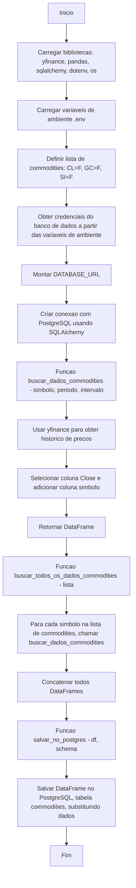

# 📊 Pipeline de Coleta e Armazenamento de Commodities

Este projeto coleta dados de preços de commodities utilizando a biblioteca [yfinance](https://pypi.org/project/yfinance/), organiza-os em um DataFrame com o [pandas](https://pandas.pydata.org/) e armazena as informações em um banco de dados PostgreSQL utilizando [SQLAlchemy](https://www.sqlalchemy.org/).

## 🚀 Funcionalidades
- Busca preços de commodities (petróleo, ouro e prata) via API do Yahoo Finance
- Armazena os dados no PostgreSQL
- Código modular com funções reutilizáveis

## 📦 Bibliotecas utilizadas
- `yfinance`
- `pandas`
- `sqlalchemy`
- `python-dotenv`
- `os`

## 📂 Estrutura do Fluxo

    O DBT é utilizado para criar views e modelos transformados diretamente no PostgreSQL.
    Isso permite centralizar o tratamento de dados e manter a lógica no banco, facilitando manutenção e escalabilidade.

    -Fluxo do DBT:

    O script Python insere os dados brutos na tabela commodities.

    O DBT cria models SQL para:

    Limpeza de dados

    Conversão de formatos

    Cálculo de métricas

    Esses models são compilados em views ou tables no PostgreSQL.

    O dashboard consome diretamente essas views, garantindo performance.

🔐 Autenticação no Dashboard
    O dashboard é protegido com um sistema de login e autenticação.
    Somente usuários autorizados podem visualizar as métricas e gráficos.

    Recursos:

    Login via formulário ou OAuth (Google, GitHub, etc.)

    Senhas criptografadas no banco

    Sessão autenticada com expiração

    Possibilidade de controle de permissões por usuário

    Bibliotecas sugeridas:

    Flask-Login (para dashboards em Flask)

    Auth0 ou Firebase Authentication (para integração externa)

    streamlit-authenticator (para dashboards em Streamlit)

📊 Arquitetura do Projeto
    Coleta de dados → Python + yfinance

    Armazenamento → PostgreSQL

    Transformação e modelagem → DBT

    Visualização → Dashboard interativo com login e autenticação

